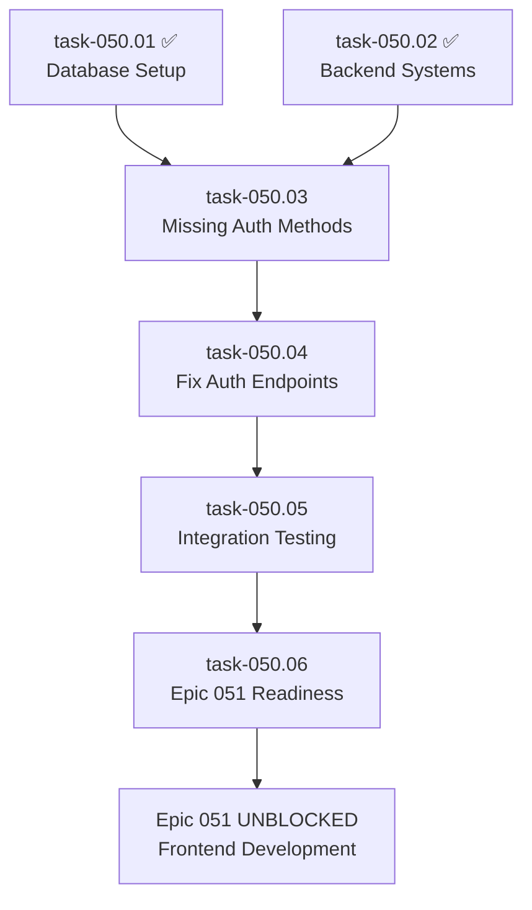

# Authentication System Fixes - Task Breakdown Summary

## Epic 050 Critical Authentication Failures

Based on comprehensive testing results from Epic 050, critical authentication issues have been identified that are blocking Epic 051 (Frontend Application) progression.

### Critical Issues Identified

**AUTHENTICATION SERVICE FAILURES:**
- Missing `AuthenticationService.authenticate_and_login()` method (called by login endpoint)
- Missing `AuthenticationService.register_user()` method (called by registration endpoint)
- Complete login/registration workflow failure with 500 errors
- Authentication endpoints returning server errors instead of proper responses

**IMPACT:**
- Epic 051 (Frontend Application) cannot proceed
- No user authentication workflow available
- Frontend developers blocked from implementing authentication UI

## Task Breakdown - 4 Critical Fix Tasks

### Task 050.03: Implement Missing Authentication Service Methods
**Priority:** Critical | **Assignee:** fullstack-engineer | **Status:** To Do

**Objective:** Implement the missing core authentication methods causing 500 errors

**Key Issues:**
- `/backend/app/api/v1/endpoints/auth.py` line 58-61 calls non-existent `authenticate_and_login()`
- Line 40 calls non-existent `register_user()`
- Both methods missing from AuthenticationService class

**Deliverables:**
- `authenticate_and_login(email: str, password: str)` → (User, token)
- `register_user(user_data: UserRegister)` → User
- JWT token generation integration
- Password hashing and validation
- RBAC system integration

**Dependencies:** task-050.01 ✅, task-050.02 ✅

---

### Task 050.04: Fix Authentication Endpoint Implementation
**Priority:** Critical | **Assignee:** fullstack-engineer | **Status:** To Do

**Objective:** Fix 500 errors in authentication endpoints

**Key Issues:**
- POST `/api/v1/auth/login` returning 500 errors
- POST `/api/v1/auth/register` returning 500 errors
- Missing proper error handling and status codes

**Deliverables:**
- Working login endpoint with proper responses
- Working registration endpoint with validation
- Proper HTTP status codes (200, 201, 400, 401, 422)
- Comprehensive input validation
- Admin user login testing (admin@sprint-reports.com)

**Dependencies:** task-050.03

---

### Task 050.05: Integration Testing and RBAC Validation
**Priority:** Critical | **Assignee:** fullstack-engineer | **Status:** To Do

**Objective:** Validate authentication system integration with existing infrastructure

**Key Issues:**
- Ensure authentication works with RBAC system
- Validate JWT token handling
- Test user session management

**Deliverables:**
- Admin user authentication validation
- JWT token system testing
- RBAC integration verification
- Session management testing
- End-to-end authentication workflow validation

**Dependencies:** task-050.03, task-050.04

---

### Task 050.06: Epic 051 Readiness Validation
**Priority:** Critical | **Assignee:** fullstack-engineer | **Status:** To Do

**Objective:** Final validation and documentation for Epic 051 readiness

**Key Issues:**
- Frontend team needs complete authentication documentation
- Epic 051 requires confirmed working authentication APIs

**Deliverables:**
- Complete authentication API documentation
- Frontend integration guide
- Authentication testing guide
- Epic 051 readiness confirmation
- Troubleshooting documentation

**Dependencies:** task-050.03, task-050.04, task-050.05

## Implementation Sequence

## Technical Details

### Current State Analysis
- **Infrastructure:** ✅ PostgreSQL, Redis, Docker stack operational
- **Database:** ✅ RBAC tables present, admin user exists
- **Backend API:** ✅ 75+ endpoints documented
- **Authentication:** ❌ Core methods missing, endpoints failing

### Root Cause
The `AuthenticationService` class in `/backend/app/services/auth_service.py` has comprehensive SSO functionality but is missing the basic authentication methods required by the API endpoints:

1. **Missing Method:** `authenticate_and_login(email, password)` 
   - **Called by:** `/api/v1/auth/login` endpoint
   - **Expected Return:** `(User, token)` tuple

2. **Missing Method:** `register_user(user_data)`
   - **Called by:** `/api/v1/auth/register` endpoint  
   - **Expected Return:** `User` object

### Files Requiring Changes
- **Primary:** `/backend/app/services/auth_service.py` - Add missing methods
- **Secondary:** `/backend/app/api/v1/endpoints/auth.py` - Error handling improvements
- **Testing:** Docker-based validation at `http://localhost:3001`

## Success Metrics

### Authentication System Health
- ✅ POST `/api/v1/auth/login` returns 200/401 (not 500)
- ✅ POST `/api/v1/auth/register` returns 201/400 (not 500)
- ✅ Admin user authentication workflow functional
- ✅ JWT tokens properly generated and validated
- ✅ RBAC integration operational

### Epic 051 Readiness
- ✅ All authentication APIs documented and working
- ✅ Frontend integration guide available
- ✅ Authentication testing procedures documented
- ✅ No blocking authentication issues remain

## Risk Mitigation

**Risk:** Changes break existing SSO functionality
**Mitigation:** Extend existing service without modifying SSO methods

**Risk:** RBAC integration issues
**Mitigation:** Use existing User model and role assignment patterns

**Risk:** JWT token compatibility issues
**Mitigation:** Follow existing token creation patterns in the service

## Epic 051 Unblocking Criteria

Epic 051 (Frontend Application) can proceed when:
1. ✅ All authentication endpoints return proper responses
2. ✅ Admin user login workflow validated
3. ✅ Authentication API documentation complete
4. ✅ Frontend integration guide available
5. ✅ No 500 errors in authentication flow

---

**Created:** 2025-08-02  
**Status:** Ready for Implementation  
**Next Action:** Assign task-050.03 to fullstack-engineer  

**CRITICAL:** These authentication fixes are blocking Epic 051 progression and must be prioritized for immediate implementation.